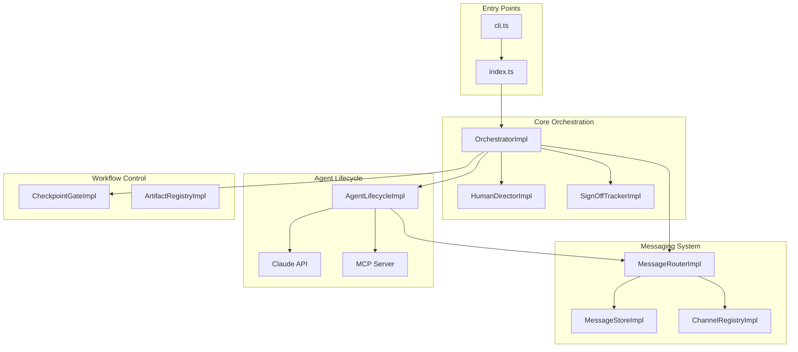
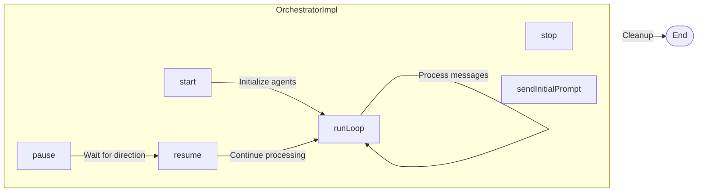
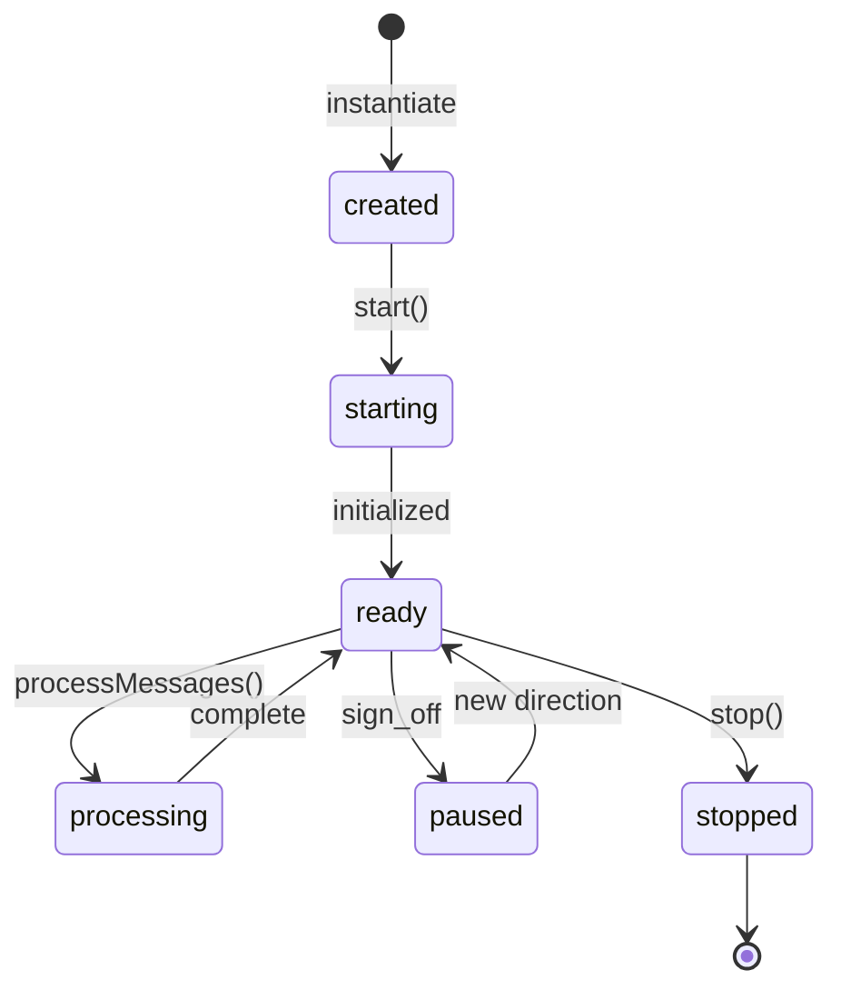
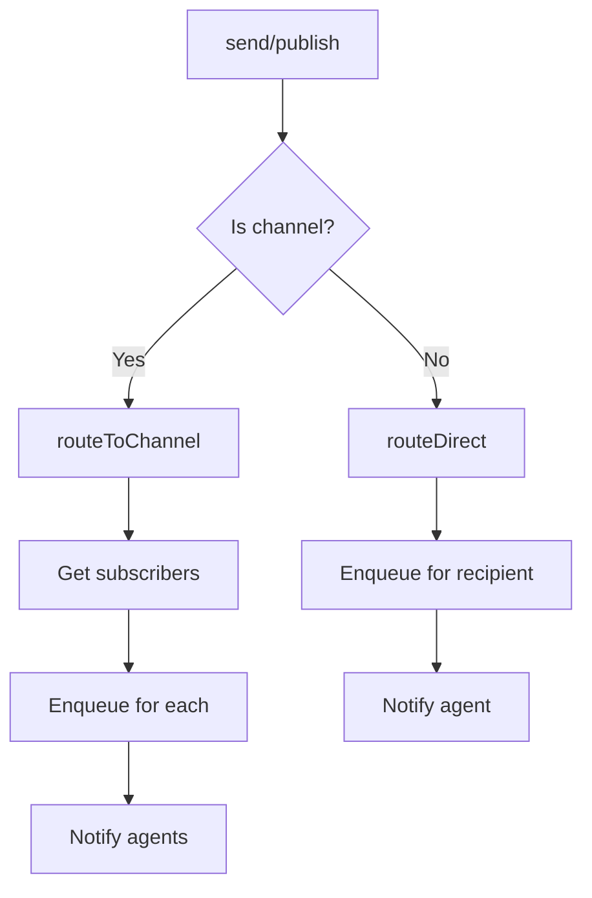
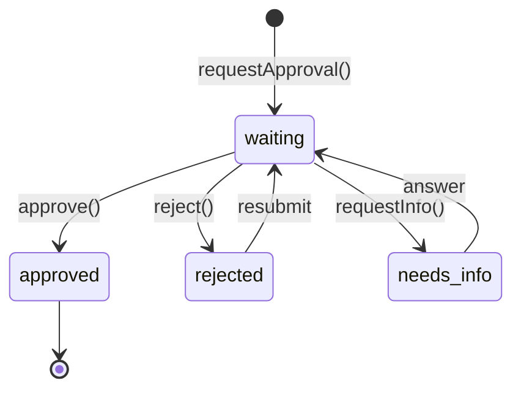
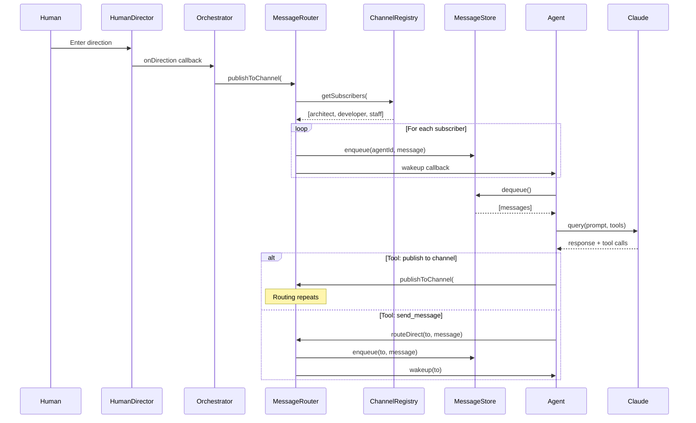
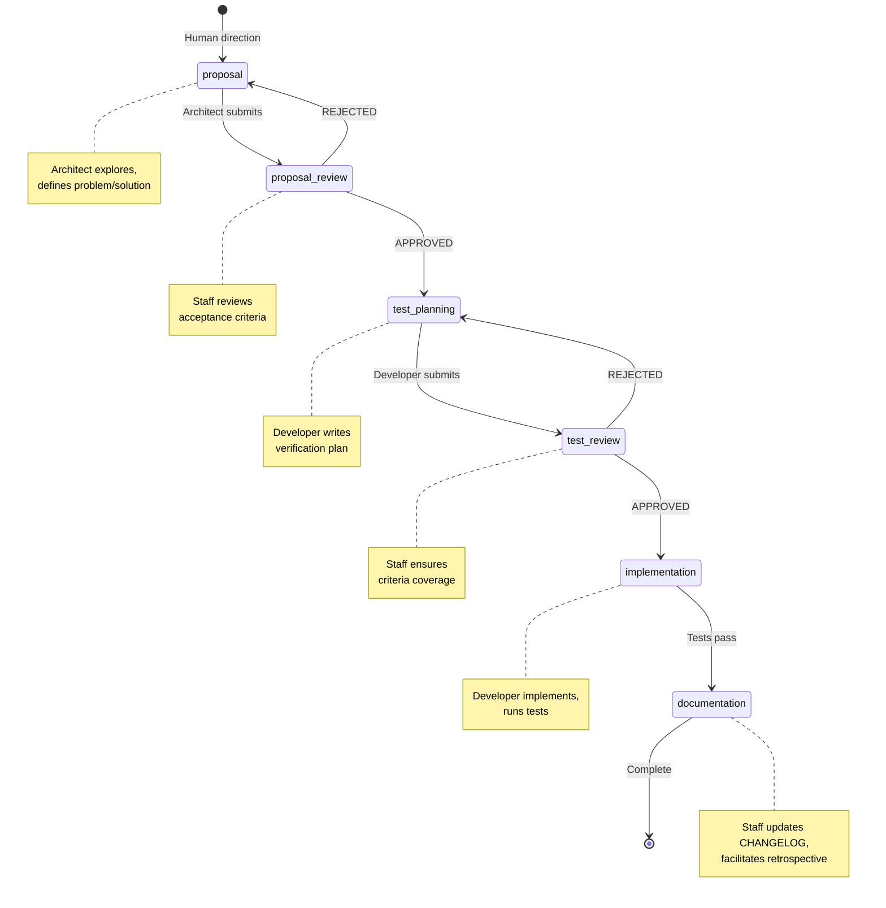
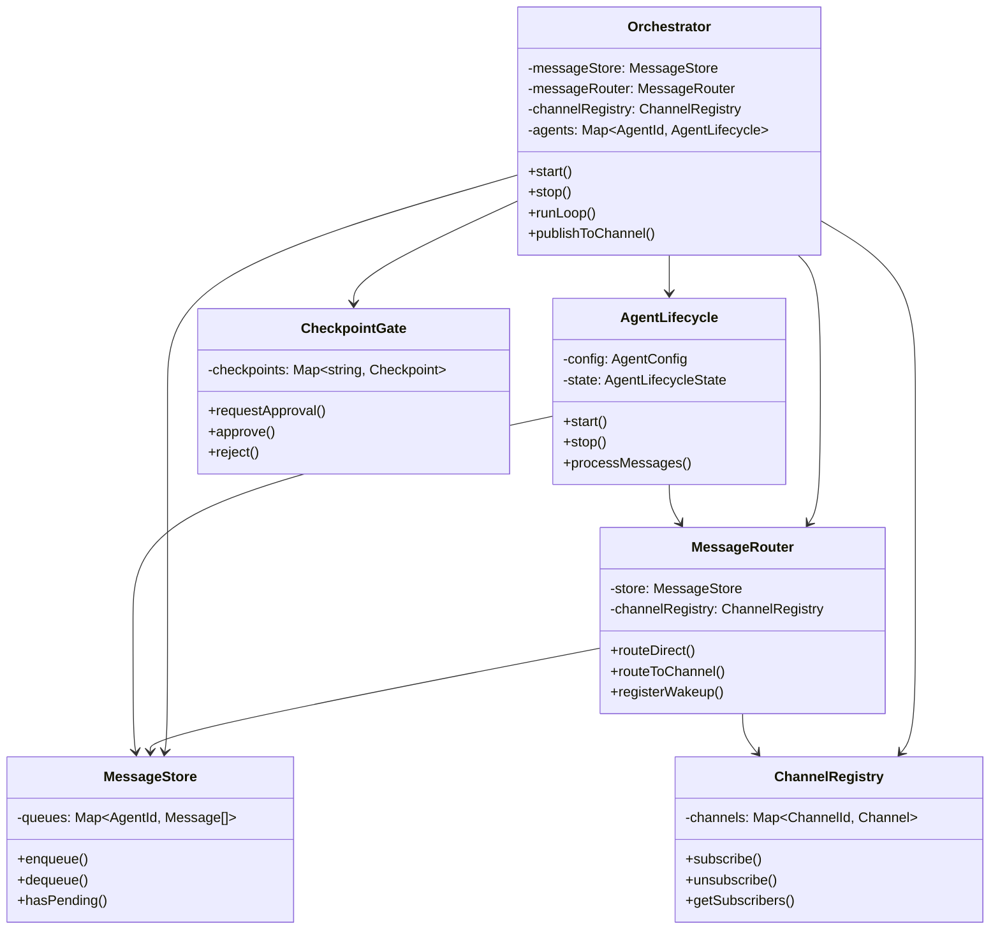

# Gimbal Architecture

This document describes the technical architecture and implementation details of gimbal, a multi-agent proxy system for peer-to-peer Claude communication.

## Overview

gimbal orchestrates multiple Claude agents that communicate via a message queue to collaboratively analyze and improve codebases. The system is built on three key principles:

1. **Single Responsibility Principle (SRP)**: Each component has one job
2. **Event-driven architecture**: Agents wake on messages, no polling
3. **Structured workflow**: Quality gates ensure work is reviewed before proceeding

## System Architecture



## Core Components

### Entry Points

#### cli.ts

Command-line interface that parses arguments and launches gimbal.

**Responsibilities:**

- Parse `--dir`, `--direction`, `--help`, `--version` flags
- Validate directory exists and is accessible
- Prompt for direction in interactive mode
- Handle graceful shutdown on SIGINT

**Key functions:**

- `parseArgs()`: Extract CLI arguments
- `validateDirectory()`: Ensure path is valid directory
- `getInitialDirection()`: Interactive prompt for user input

#### index.ts

Agent configuration and orchestrator initialization.

**Responsibilities:**

- Define agent configurations (id, name, systemPrompt, model, tools)
- Create and configure OrchestratorImpl
- Subscribe agents to initial channels
- Initialize knowledge agent with codebase scan
- Start architect with initial direction

**Agent definitions:**

| Agent     | Model  | Tools                              | Role                    |
|-----------|--------|------------------------------------|-------------------------|
| architect | sonnet | Read, Glob, Grep                   | Explore, propose        |
| developer | sonnet | Read, Edit, Write, Bash, Glob, Grep| Implement, test         |
| staff     | opus   | Read, Write, Bash, Glob, Grep      | Review, approve, document|
| knowledge | sonnet | Read, Glob, Grep                   | Answer codebase questions|

### Orchestrator (orchestrator.ts)

The main coordinator that manages all components and the event loop.



**Responsibilities:**

- Initialize all SRP components (MessageStore, MessageRouter, ChannelRegistry, etc.)
- Create AgentLifecycleImpl instances for each agent config
- Run event-driven loop where agents wake on incoming messages
- Handle human direction input and broadcast to agents
- Manage pause/resume when all agents sign off
- Coordinate channel subscriptions

**Key methods:**

- `start()`: Initialize all agents
- `stop()`: Graceful shutdown
- `runLoop()`: Event-driven message processing loop
- `sendInitialPrompt()`: Kick off an agent with initial instructions
- `publishToChannel()`: Broadcast message to channel subscribers
- `subscribeAgentToChannel()`: Add agent to channel

### Agent Lifecycle (agent-lifecycle.ts)

Manages an individual agent's lifecycle and Claude API interactions.



**Responsibilities:**

- Track agent state (created, starting, ready, processing, paused, stopped)
- Create MCP server with messaging tools for each agent
- Format incoming messages for Claude
- Call Claude API with appropriate model, tools, and system prompt
- Manage session resumption for conversation continuity

**MCP Tools provided to agents:**

| Tool           | Description                                    |
|----------------|------------------------------------------------|
| send_message   | Direct message to another agent                |
| broadcast      | Message to all agents                          |
| list_agents    | List available agents                          |
| subscribe      | Join a channel                                 |
| unsubscribe    | Leave a channel                                |
| publish        | Post to channel (all subscribers receive)      |
| list_channels  | Show channels and subscriptions                |
| sign_off       | Signal work complete, waiting for direction    |

### Messaging System

The messaging system is split into three SRP components:

#### MessageRouter (message-router.ts)

Determines WHERE messages go.



**Responsibilities:**

- Route direct messages to specific agents
- Route channel messages to all subscribers (except sender)
- Manage wakeup callbacks to notify agents of new messages
- Generate unique message IDs

**Key methods:**

- `routeDirect()`: Send to specific agent
- `routeToChannel()`: Send to channel subscribers
- `routeToAll()`: Broadcast to all agents
- `registerWakeup()`: Set callback for agent wakeup

#### MessageStore (message-store.ts)

Handles message persistence and retrieval.

**Responsibilities:**

- Maintain per-agent message queues
- Enqueue incoming messages
- Dequeue messages for processing (clears queue)
- Track which agents have pending messages

**Key methods:**

- `createQueue()`: Initialize queue for new agent
- `enqueue()`: Add message to agent's queue
- `dequeue()`: Get and clear all pending messages
- `hasPending()`: Check if agent has messages

#### ChannelRegistry (channel-registry.ts)

Tracks pub/sub subscriptions.

**Responsibilities:**

- Manage channel creation (on first subscribe)
- Track subscribers per channel
- Remove empty channels (on last unsubscribe)
- List channels and subscription counts

**Key methods:**

- `subscribe()`: Add agent to channel (creates channel if needed)
- `unsubscribe()`: Remove agent from channel (deletes empty channels)
- `getSubscribers()`: List agents subscribed to channel
- `getSubscriptions()`: List channels an agent is subscribed to

### Workflow System

#### CheckpointGate (checkpoint.ts)

Controls workflow progression through approval checkpoints.



**Responsibilities:**

- Create checkpoints when work needs approval
- Track checkpoint status (waiting, approved, rejected, needs-info)
- Record which phases have been approved
- Prevent progression until approval granted

**Key methods:**

- `requestApproval()`: Create new checkpoint for phase
- `approve()`: Mark checkpoint approved
- `reject()`: Mark checkpoint rejected with reason
- `isPhaseApproved()`: Check if phase can proceed

#### ArtifactRegistry (artifact.ts)

Tracks work products produced during workflow.

**Artifact types:**

- `proposal`: Problem + solution + acceptance criteria
- `test-plan`: Verification approach
- `implementation`: Code changes
- `test-results`: Evidence tests passed
- `changelog-entry`: Change documentation
- `retrospective`: Process learnings

### Human Director (human-director.ts)

Handles human input via readline interface.

**Responsibilities:**

- Listen for direction input during execution
- Handle sign-off prompts (continue vs fresh start)
- Broadcast direction to orchestrator
- Manage graceful quit

## Message Flow



## Workflow Phases



## Component Interaction



## Data Structures

### Message

```typescript
interface Message {
  id: string;           // Unique identifier (e.g., "msg_1")
  from: string;         // Sender agent ID
  to: string;           // Recipient agent ID or channel ID
  content: string;      // Message body
  timestamp: number;    // Unix timestamp
  replyTo?: string;     // ID of message being replied to
  channel?: string;     // Channel ID if published to channel
}
```

### Envelope

```typescript
interface Envelope {
  content: string;       // Message content
  replyTo?: string;      // Reply reference
  phase?: PhaseId;       // Workflow phase context
  checkpointId?: string; // Associated checkpoint
}
```

### AgentConfig

```typescript
interface AgentConfig {
  id: string;                    // Unique agent identifier
  name: string;                  // Display name
  systemPrompt: string;          // Claude system prompt
  model?: "sonnet" | "opus" | "haiku";  // Claude model
  tools?: ToolName[];            // Allowed code tools
}
```

### Checkpoint

```typescript
interface Checkpoint {
  id: string;                    // Unique checkpoint ID
  phase: PhaseId;                // Workflow phase
  approver: AgentRole;           // Role that must approve
  status: CheckpointStatus;      // waiting | approved | rejected | needs-info
  artifactRef: string;           // Reference to work being reviewed
  timestamp: number;             // Creation time
  reason?: string;               // Approval/rejection reason
}
```

## Extension Points

### Adding New Agents

1. Add agent config to `agents` array in `src/index.ts`:

```typescript
{
  id: "reviewer",
  name: "Code Reviewer",
  systemPrompt: `Your system prompt here...`,
  model: "sonnet",
  tools: ["Read", "Glob", "Grep"],
}
```

2. Subscribe to appropriate channels in the initialization section:

```typescript
orchestrator.subscribeAgentToChannel("reviewer", "#implementation");
```

### Adding New Tools

1. Add tool name to `ToolName` union in `src/types.ts`:

```typescript
export type ToolName = "Read" | "Edit" | "Write" | "Bash" | "Glob" | "Grep" | "NewTool";
```

2. Include in agent's `tools` array in config.

Note: Code tools are provided by the Claude Agent SDK. Custom tools would require MCP server implementation.

### Customizing Workflow

The workflow phases are defined in `WORKFLOW_PHASES` in `src/types.ts`. To modify:

1. Update `PhaseId` type with new phases
2. Update `WORKFLOW_PHASES` record with phase definitions
3. Update `PHASE_APPROVERS` in `checkpoint.ts` if approval rules change

## File Reference

| File | Purpose |
|------|---------|
| `src/cli.ts` | CLI entry point, argument parsing |
| `src/index.ts` | Agent configuration, orchestrator setup |
| `src/orchestrator.ts` | Main coordinator, event loop |
| `src/agent-lifecycle.ts` | Agent state machine, Claude API calls |
| `src/message-router.ts` | Message routing logic |
| `src/message-store.ts` | Per-agent message queues |
| `src/channel-registry.ts` | Pub/sub subscription management |
| `src/checkpoint.ts` | Workflow approval gates |
| `src/artifact.ts` | Work product tracking |
| `src/human-director.ts` | Human input handling |
| `src/sign-off-tracker.ts` | Track agent sign-offs |
| `src/types.ts` | TypeScript interfaces and type definitions |
